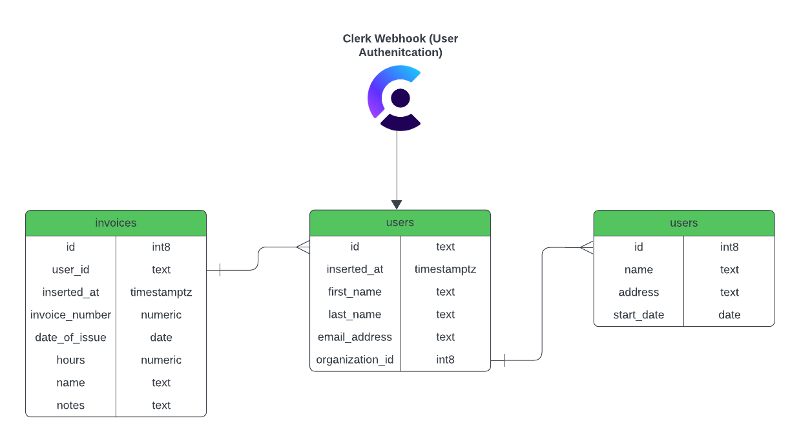

# Ho'onui Technologies: Software Consulting Practice Website

### Overview
This repository contains the code for a full-stack application designed for a software consulting practice. The app features a responsive front-end built with NextJS and TypeScript, and a robust backend powered by Supabase. It integrates Clerk for user authentication and uses webhooks to automate database synchronization tasks.

## Features
- **Responsive Front-End Design**: Built using NextJS and TypeScript, ensuring a seamless user experience across various devices and browsers.
- **Secure Backend**: Utilizes Supabase for backend operations, providing reliable and scalable cloud-based solutions.
- **User Authentication**: Integrated with Clerk to offer secure and flexible user login functionalities.
- **Automated Workflows**: Webhooks are used to sync multiple databases between Clerk and Supabase, enhancing data consistency and operational efficiency.

## Getting Started
To get a local copy up and running, follow these simple steps.

### Prerequisites
- npm
  ```sh
  npm install npm@latest -g
  ```

### Installation
1. Clone the repo
  ```sh
  git clone [Your Repo URL]
  ```
2. Install NPM packages
  ```sh
  npm i 
  ```
3. Run development mode:
  ```sh
  npm run dev
  ```

### Supabase
Overview
Our project leverages Supabase for backend database needs, offering scalable, efficient, and easy-to-manage data solutions.

#### Integration with Clerk Authentication
Webhooks Connection: We've integrated Clerk's authentication system with our Supabase databases using webhooks, ensuring real-time synchronization between user authentication states and our database records.
Seamless Sync: This setup guarantees immediate updates in our databases corresponding to user activities in Clerk, like sign-ups or profile changes.

#### Database Structure



